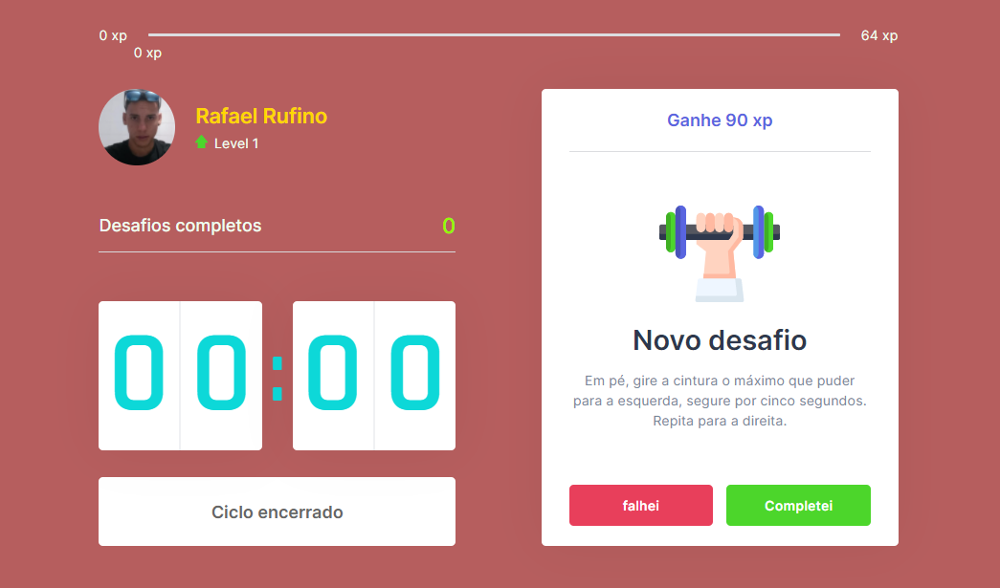
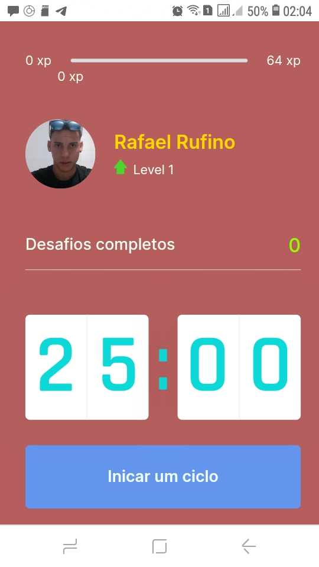

<h3 align="center">
    
    <br><br>
    <b> Plataforma pra incentivar a pratica de exercicios fisicos!</b>  
    <br>
</h3>


# Índice

- [Sobre](#sobre)
- [Tecnologias Utilizadas](#tecnologias-utilizadas)
- [Como Usar](#como-usar)
- [Como Contribuir](#como-contribuir)

<a id="sobre"></a>


## :bookmark: Sobre

	
O <strong>moveit$</strong>é uma aplicação Web e Mobile que une a técnica de Pomodoro com a realização de exercícios físicos para quem passa muito tempo na frente do computador.

Essa aplicação foi construída na trilha <strong>Next Level Week </strong> foi distribuída pela [Rocketseat](https://rocketseat.com.br/). A ideia de criar uma aplicação voltada para realização de exercícios físicos, surgiu da necessidade de incentivar as pessoas que passam muito tempo na frente do computador, fazer alogamentos para evitar complicações futuras no corpo.

<br>


<a id="tecnologias-utilizadas"></a>

## :rocket: Tecnologias Utilizadas

O projeto foi desenvolvido utilizando as seguintes tecnologias

- [Html](https://developer.mozilla.org/pt-BR/docs/Aprender/HTML/Introducao_ao_HTML)
- [JavaScript](https://developer.mozilla.org/pt-BR/docs/Web/JavaScript)
- [React](https://reactjs.org/)
- [Nextjs](https://nextjs.org/)
- [Typescrip](https://www.typescriptlang.org/)


## :heavy_check_mark: :computer: Prototipo da Aplicação

- O layout está disponível no **[Figma](https://www.figma.com/file/ks4LBWiogWXk5NkdTTBWjT/Move.it-1.0-(Copy))**;


## :heavy_check_mark: :computer: Resultado Web

<h1 align="center">
    
</h1>

</br>

## :heavy_check_mark: :computer: Resultado Mobile

<h1 align="center">
    
</h1>


<a id="como-usar"></a>


## :heavy_check_mark: :computer: Acessar App
- O Aplicação está disponível no **[Moveit](https://moveit-rafael-rufino.vercel.app/)**;


## :fire: Como usar


1. Faça um clone :

```sh
  $ git clone https://github.com/Rafael-Rufino/Next-level-Week-4-movi.it.git

```

```sh
2. Executando a Aplicação:
  # Install as dependências
  $ yarn install

  # Inicie a aplicação web
  $ cd moveit-next 
  $ npm run dev
  # or
  yarn dev
  # Acessar o Servidor no Navegador
  $ http://127.0.0.1:3000/
 
  # Porta de Acesso Liberado
  $ 3000

```

## Pesistencia dos dados
- No Cookie do navegador, dados ficam salvo no armazenamento local.


## :recycle: Como contribuir

- Faça um Fork desse repositório,
- Crie uma branch com a sua feature: `git checkout -b my-feature`
- Commit suas mudanças: `git commit -m 'feat: My new feature'`
- Push a sua branch: `git push origin my-feature`


🎓 **Quem ministrou?**

As aulas foram ministradas pelo mestre Diego Fernandes - Instructor - Rocketseat nas aulas do Next Level Week.

📝 **License**

Esse projeto está sob a licença MIT. Veja o arquivo [LICENSE](LICENSE.md) para mais detalhes.


<h4 align="center">
    Feito com 💜 by <a href="https://www.linkedin.com/in/rafael-r-dos-santos-b889311ba/" target="_blank">Rafael Rufino</a>
</h4>


